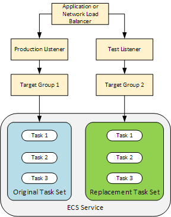
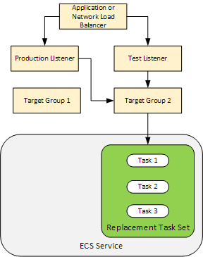

# Lab 5: Blue/Green Deployments

## Objective

In this module you will:

* Update app stack to support blue/green deployments using AWS CodeDeploy in the production environment.
* Create a CodeDeploy application and deployment configuration.
* Update the pipeline stack to use CodeDeploy in the production stage.
* Add `appspec.yaml` and `taskdef.json` to the `cdk-workshop-2024` folder.

## Blue/Green Deployments

A blue/green deployment is a deployment strategy in which you create two separate, but identical environments. One environment (blue) is running the current application version and one environment (green) is running the new application version.

Using a blue/green deployment strategy increases application availability and reduces deployment risk by simplifying the rollback process if a deployment fails. Once testing has been completed on the green environment, live application traffic is directed to the green environment and the blue environment is deprecated.

#### Before deployment

#### During deployment

#### After deployment

## Update Prod Environment and the Code Pipeline

We already defined the infrastructure in the previous lab and we can re-use that code so all we need to do is update a production instance.

Before you do that, you will need to:

* Update and deploy the pipeline stack (remove the production stage).
* Update and deploy the prod app stack (add new Fargate service that supports CodeDeploy controller).
* Update and deploy the pipeline stack (add the production stage that deploys to the production application stack created in the above step).
* Add `appspec` and `taskdef` files.
