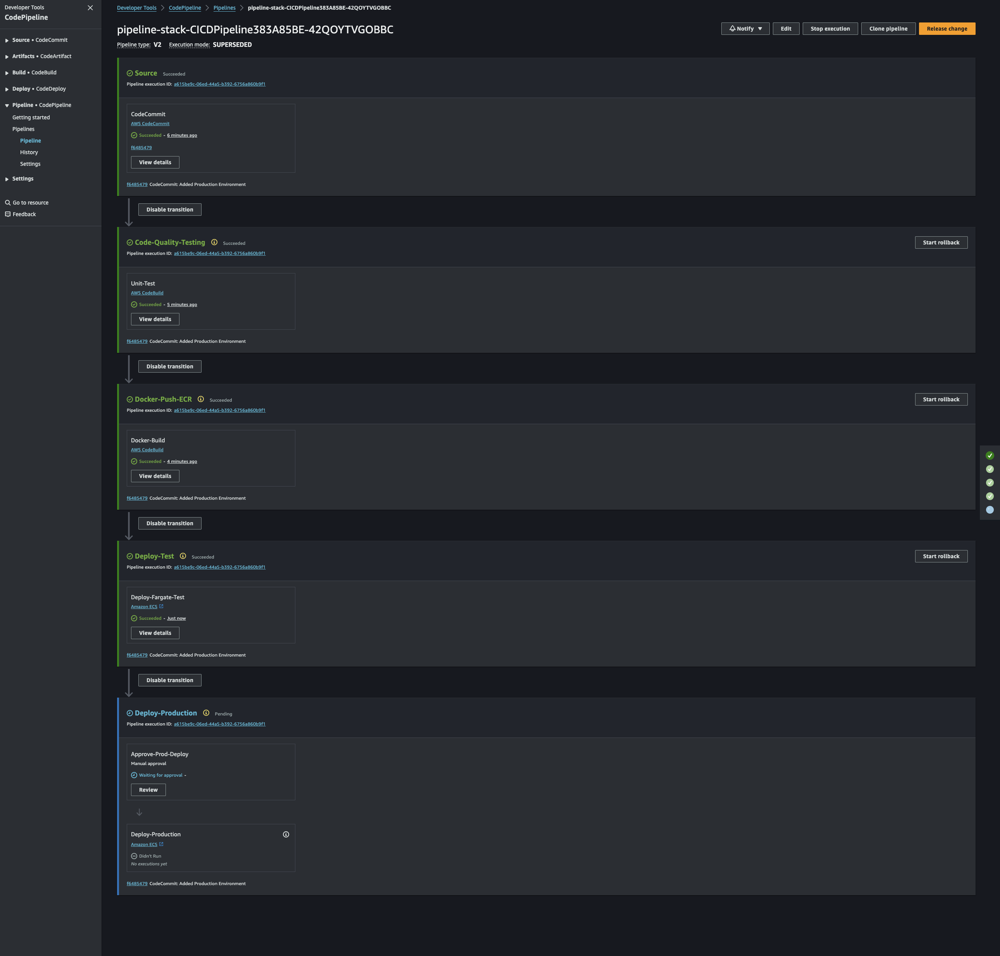

# Gated Delivery Deployment

This is, I coined, the `baseline` such that 

* CodePipeline carry deployment automation 
* from CodeCommit merges, 
* trigger CodeBuild, 
* run unit test suites, 
* publish QC coverage reports, 
* deploy to Test environment, 
* then waiting manual approval for production. Hence, "Gated Delivery".

This should be typical standard CICD pipeline procedure in most cases.

---

