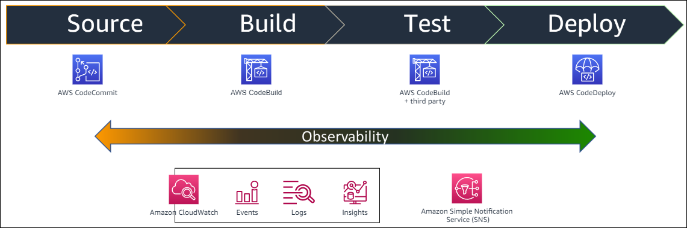
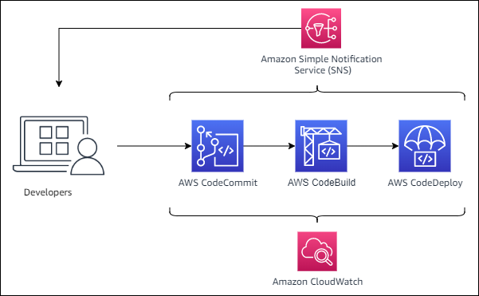
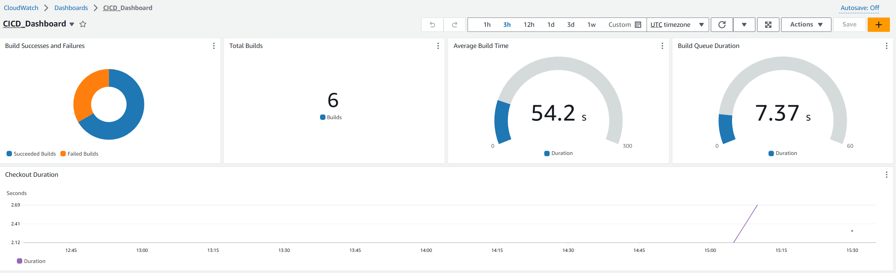
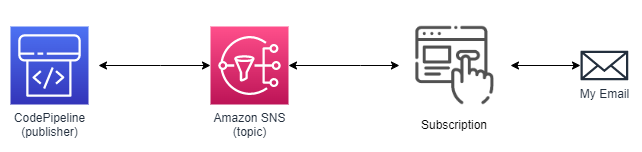

# Lab 6: Observability

> See [outcome](outcome) for workshop exercise.

## Objective

In this module you will:

* Configure a CloudWatch dashboard to report on:
    * Build successes and failures.
    * Code checkout duration.
* Send an email alert if a build fails.

## Observability Overview

Observability is the ability to measure the internal states of a system by examining its outputs. A system is considered “observable” if the current state can be estimated by only using information from outputs.

Observability is one of the key principles of DevOps as it provides a fast feedback loop to developers while also providing actionable insights to drive decision making.

In this lab we will be generating a CloudWatch dashboard that will visualize common CI metrics as well as setting up an SNS notification to alert Developers of a build failure:

## CloudWatch Dashboard

The benefit of dashboards is they provide the ability to visualize data points over time. If anomalous behavior starts to occur, it may not be readily apparent unless it is tracked and plotted on a graph. For example, assume you setup a new pipeline, and on day 1, it takes 5 min to run the pipeline end-to-end. After 6 months, you notice that your pipeline is taking much longer to run, and are curious as to why. If you are tracking and plotting data points on a dashboard, you can quickly identify where the longer running steps are occurring.

## SNS Notification

One of the key principles of DevOps is the concept of fast feedback loops. The idea is to provide feedback to any issues caused by a recent code change to the developer as quickly as possible. This will give the developer a chance to address the issue before they have moved on to another task and the change is no longer fresh in their mind. One way to accomplish this fast feedback is to alert the developer using a communication medium such as email, Slack notification, or similar.

